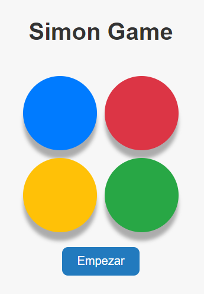

# Juego Simon

## Descripción
**Simon** es un juego de memoria electrónica diseñado originalmente en 1978. Este proyecto recrea la experiencia clásica de Simon utilizando tecnologías web modernas: **HTML**, **CSS** y **JavaScript**. El diseño incluye características responsive para garantizar que el juego funcione correctamente en diferentes dispositivos, desde teléfonos móviles hasta pantallas de escritorio.

Este repositorio ofrece una versión interactiva y visualmente atractiva del juego, ideal tanto para fines recreativos como educativos.

---

## Visualización
1. Clona el repositorio o descárgalo como archivo ZIP.
2. Asegúrate de tener instalado un servidor local o una extensión como "Live Server" para ejecutar archivos HTML.
3. Abre el archivo `index.html` utilizando "Live Server" o tu navegador preferido.

---

## Objetivo del Juego
El objetivo principal del juego Simon es desafiar tu memoria repitiendo una secuencia de luces y sonidos generada aleatoriamente. Cada vez que repitas correctamente la secuencia, esta se alargará, aumentando la dificultad del juego.

**¿Hasta dónde puedes llegar sin equivocarte?**

---

## Cómo jugar
1. **Inicio**:
   - Abre el archivo `index.html` en tu navegador.
   - Presiona el botón de inicio para comenzar el juego.
2. **Secuencia inicial**:
   - Una luz y un sonido se activarán en uno de los botones.
3. **Repite la secuencia**:
   - Haz clic en los botones en el mismo orden en que se activaron.
4. **Progresión**:
   - Con cada secuencia repetida correctamente, se añadirá un nuevo paso.
5. **Errores**:
   - Si cometes un error, el juego se detendrá y mostrará tu puntuación final.
6. **Vuelve a intentarlo**:
   - Presiona el botón de reinicio para comenzar un nuevo juego.

---

## Funcionalidades
- **Diseño Responsive**:
  - Ajuste dinámico para pantallas de dispositivos móviles, tabletas y escritorios.
  - Uso de **Media Queries** en CSS para optimizar la presentación visual.
- **Interactividad**:
  - Generación de secuencias aleatorias de colores y sonidos.
  - Respuesta visual y sonora al interactuar con los botones.
- **Puntuación**:
  - Sistema para rastrear y mostrar la secuencia más larga que has completado.
- **Sonidos auténticos**:
  - Archivos de audio integrados para reproducir sonidos únicos asociados a cada botón.

---

## Estructura del Repositorio
- **`index.html`**:
  Contiene la estructura principal del juego.
- **`style.css`**:
  Diseña los botones, las animaciones y la presentación general del juego.
- **`script.js`**:
  Controla la lógica del juego, la interacción del usuario y la generación de secuencias.
---

¡Disfruta del juego y sigue mejorando tu memoria! 🚀
